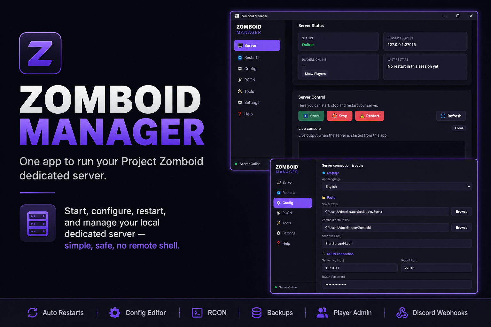
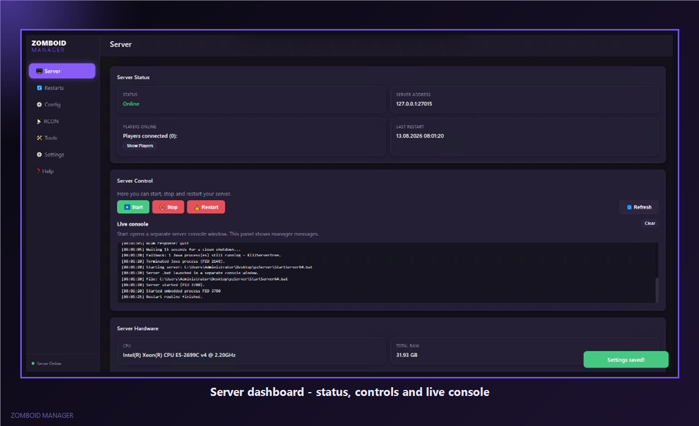
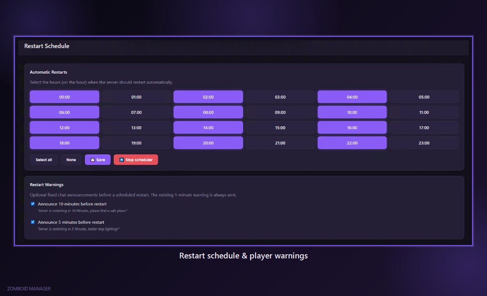
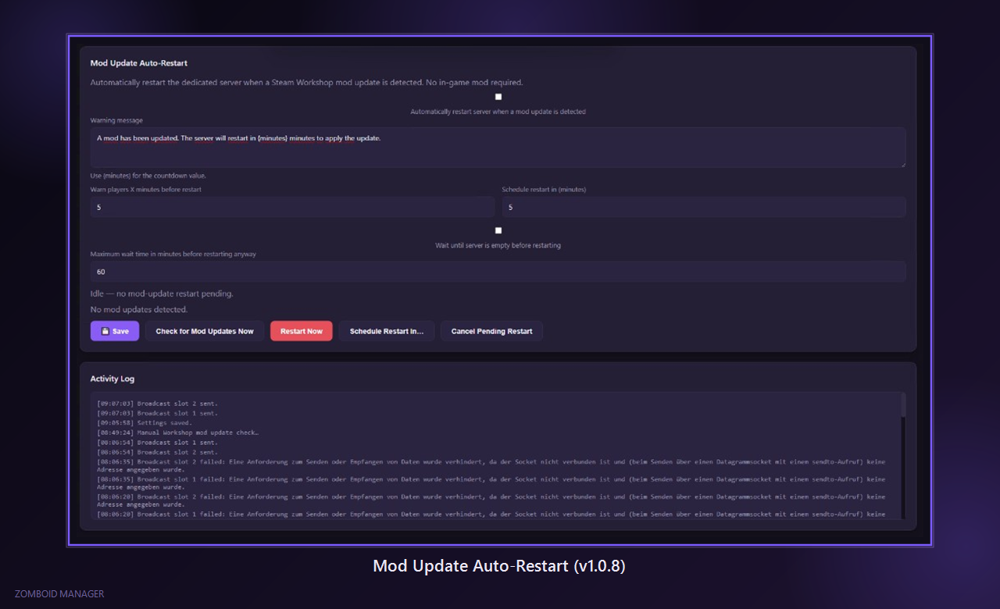
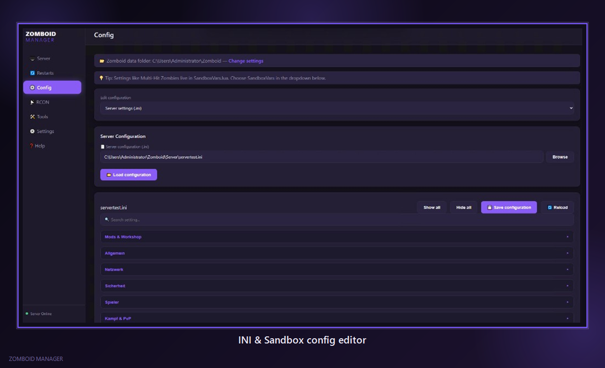
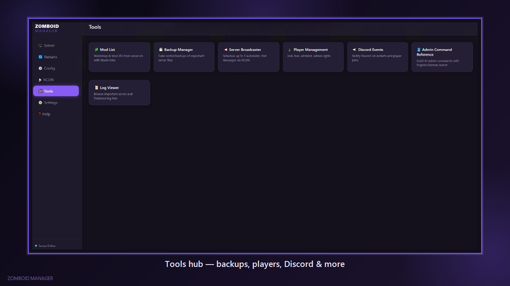

# Zomboid Manager

  

  <strong>Local dedicated server control for Project Zomboid</strong> 
  One Windows app for start/stop, restarts, config, RCON, backups, players, Discord — without a remote shell or a public web panel

  
  
  

  <a href="https://github.com/Vuscoo/zomboidmanager/releases"><strong>Download latest EXE</strong></a>
  ·
  <a href="BUILD.md">Build from source</a>
  ·
  <a href="CHANGELOG.md">Changelog</a>

---

## Screenshots

| Server dashboard | Restart schedule |
| :---: | :---: |
|  |  |

| Mod Update Auto-Restart (v1.0.8) | Config editor |
| :---: | :---: |
|  |  |

   
  <em>Tools hub  -  backups, broadcaster, players, Discord, logs, and more</em>

---

## What it does

**Server**
- Start / Stop / Restart with live status, address, players, and last restart time
- Manager console with timestamps
- Hardware panel (CPU / RAM / disk) and configured ports

**Restarts**
- Hourly restart schedule (pick any hours of the day)
- Optional 10- and 5-minute chat warnings (1-minute warning always kept)
- **Mod Update Auto-Restart**  -  when Steam Workshop mods update, optionally warn players, wait until the server is empty, then cleanly save → quit → start

**Config**
- Edit `server.ini` / `servertest.ini` with categories and search
- Dedicated SandboxVars.lua categories (gameplay rules where they belong)
- Clean Mods & Workshop section (Workshop IDs + Mod IDs)

**RCON & players**
- Full RCON console + quick actions
- Player management: kick / ban / whitelist, access levels, godmode, teleport, items / XP

**Tools**
- Server Broadcaster (up to 5 scheduled chat messages)
- Backup Manager (manual + weekly / one-time schedules)
- Log Viewer, Admin Command Reference (Build 42), Mod List with Steam links
- Discord webhook events (restarts, mod updates, custom hourly messages, and more)

**App**
- Multi-language UI (EN / DE complete; more languages for core strings)
- Single-file distribution  -  settings live in `%LocalAppData%\ZomboidManager\`
- Open source on this repository; official builds under [Releases](https://github.com/Vuscoo/zomboidmanager/releases)

---

## Who it's for

Anyone hosting a **local** Project Zomboid dedicated server on Windows who wants a clean control panel instead of juggling console windows, Notepad, and RCON tools.

Designed for localhost / LAN use. Keep RCON on `127.0.0.1` or your LAN  -  **do not** expose RCON to the public internet.

---

## Requirements

- Windows 10 / 11 (x64)
- [Microsoft Edge WebView2 Runtime](https://developer.microsoft.com/microsoft-edge/webview2/) (usually preinstalled)
- Your Project Zomboid dedicated server folder + start `.bat` (e.g. `StartServer64.bat`)
- Optional: RCON enabled in `server.ini` for console, players, broadcasts, and mod-restart flow

> Release builds are **self-contained**. You do **not** need to install the .NET runtime to run the downloaded EXE.

---

## How to use

1. Download **`ZomboidManager.exe`** from [Releases](https://github.com/Vuscoo/zomboidmanager/releases)
2. Run the EXE (no installer)
3. Open **Settings** → set Server folder, Zomboid data folder, start `.bat`, and RCON details
4. Use **Server**, **Restarts**, **Config**, **RCON**, and **Tools**

Settings are stored under `%LocalAppData%\ZomboidManager\` so updates do not wipe your configuration.

---

## Source code

This repository contains the full application source so you can inspect what the EXE does and build it yourself.

- End users: download from **Releases** (recommended)
- Developers: see **[BUILD.md](BUILD.md)** for clone, config template, and `dotnet publish`

Template config (placeholders only): [`config.example.json`](config.example.json)  
Real `config.json` with passwords / webhooks must never be committed.

---

## Support

- Discord: https://discord.gg/2YJTzATKGn  
- Donate: https://linktr.ee/vusco  
- Changelog: [CHANGELOG.md](CHANGELOG.md)

---

## About

Personal hobby project, built with AI-assisted development (Cursor). Functional and usable, maintained casually  -  expect rough edges.

---

## License / disclaimer

License: *TBD* (to be decided separately).

Not affiliated with The Indie Stone. Project Zomboid is © The Indie Stone.  
Use at your own risk  -  always keep world backups.
