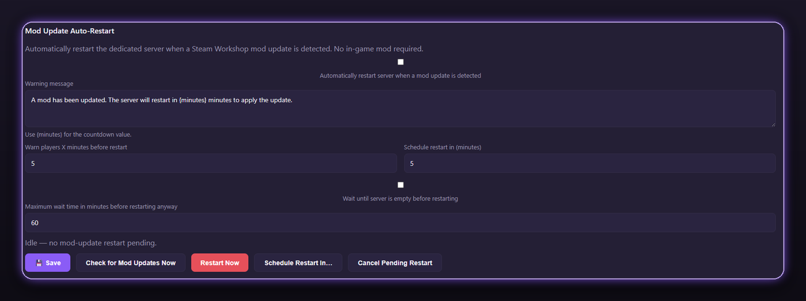
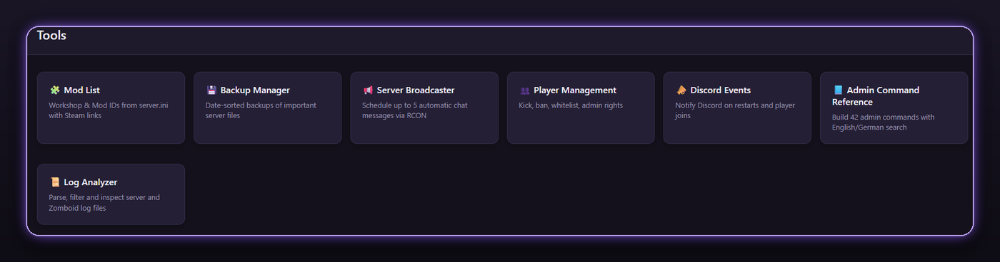
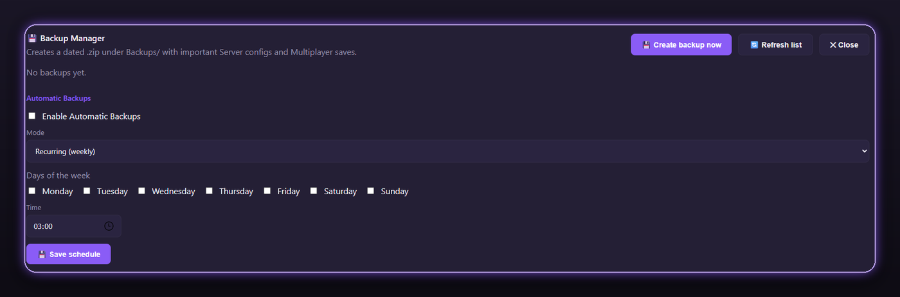
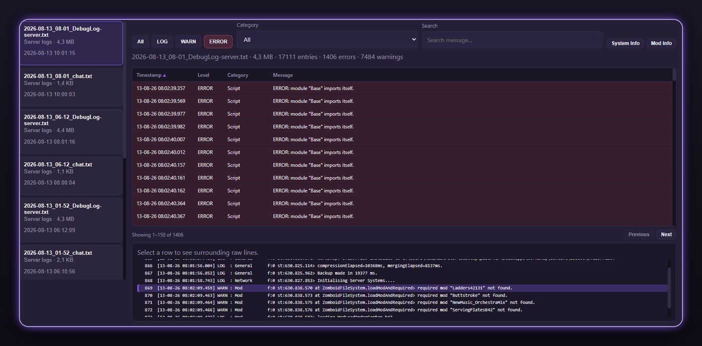
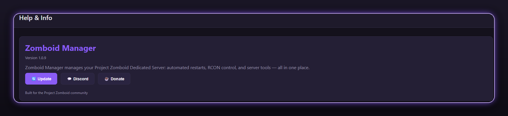

  

# Zomboid Manager

  <strong>Local dedicated server control for Project Zomboid</strong> 
  One Windows app for start/stop, restarts, config, RCON, backups, players, Discord — without a remote shell or a public web panel

  
  
  

  <a href="https://github.com/Vuscoo/zomboidmanager/releases"><strong>Download latest EXE</strong></a>
  ·
  <a href="BUILD.md">Build from source</a>
  ·
  <a href="CHANGELOG.md">Changelog</a>

---

## What it does

**Server Control**
- Start / Stop / Restart with live status, address, players, and last restart time
- Manager console with timestamps (capped so long sessions stay readable)
- Hardware panel (CPU / RAM / disk) and configured ports plus server admins
- Show Players on the Server tab for a quick connected-player list

**Restarts & Automation**
- Hourly restart schedule (pick any hours of the day)
- Optional 10- and 5-minute chat warnings (1-minute warning always kept)
- **Mod Update Auto-Restart**  -  when Steam Workshop mods update, optionally warn players, wait until the server is empty, then cleanly save → quit → start
- Manual controls: Check for Mod Updates Now, Restart Now, Schedule Restart In…, Cancel Pending Restart

**Config Management**
- Edit `server.ini` / `servertest.ini` with categories and search
- Dedicated SandboxVars.lua categories (gameplay rules where they belong)
- Clean Mods & Workshop section (Workshop IDs + Mod IDs)
- **Config Profiles**  -  save named snapshots of the active server.ini + SandboxVars.lua, then load / rename / delete them (load backs up what you have first and offers a restart)

**RCON & Players**
- Full RCON console + quick actions (list players, save world, server message, quit)
- Player management: search, kick / ban / unban (including SteamID), access levels, godmode / invisible, teleport, items / XP
- **Whitelist Manager**  -  accounts from the world database (username, access level, SteamID, banned); add / remove via RCON; info note if the server is open (`Open=true`)

**Tools**
- Hub for backups, broadcasts, players, Discord, logs, mods, and admin commands

- **Backup Manager**  -  dated zip of server configs + Multiplayer world; Backup Now or weekly / one-time schedules; progress in a corner panel (cancel supported)

- **Log Analyzer**  -  readable table from the server `logs` folder and `Zomboid\Logs`; filter by level / category, search, ERROR/WARN tinting, row context, System Info / Mod Info panels

- **Server Broadcaster**  -  up to 5 scheduled chat messages (one-time or recurring) plus Send Now
- **Admin Command Reference**  -  searchable Build 42 admin commands (English / German keywords)
- **Mod List**  -  Workshop & Mod IDs from server.ini with Steam links (tiles or list)

**Notifications**
- Discord webhook with a master switch and five configurable events (enable toggle, editable template, placeholders, live preview)
- Events: restart routine started, scheduled restart triggered, server restarted, mods updated (only when Workshop timestamps changed), custom hourly message

**Statistics**
- Dedicated Statistics tab (separate from the live hardware meters on Server)
- Records player count, CPU, RAM, and free disk while the dedicated server is running
- Charts for players and CPU/RAM with **24h / 7 days / 30 days** ranges
- Restart history with reason: scheduled, manual, mod-update, or unexpected exit
- Uptime % plus planned vs unexpected downtime; history kept for a configurable number of days (default 30)

**App**
- Multi-language UI (EN / DE complete; more languages for core strings)
- Help & Info tab: version, in-app update check, Discord, donate
- Single-file distribution  -  settings live in `%LocalAppData%\ZomboidManager\`
- Open source on this repository; official builds under [Releases](https://github.com/Vuscoo/zomboidmanager/releases)

---

## Who it's for

Anyone hosting a **local** Project Zomboid dedicated server on Windows who wants a clean control panel instead of juggling console windows, Notepad, and RCON tools.

Designed for localhost / LAN use. Many tools (players, whitelist, broadcasts, restart warnings, mod-update restarts) talk to the server over RCON  -  keep RCON on `127.0.0.1` or your LAN. **Do not** expose RCON to the public internet.

---

## Requirements

- Windows 10 / 11 (x64)
- [Microsoft Edge WebView2 Runtime](https://developer.microsoft.com/microsoft-edge/webview2/) (usually preinstalled)
- Your Project Zomboid dedicated server folder + start `.bat` (e.g. `StartServer64.bat`)
- RCON enabled in `server.ini` for console, player management, whitelist, broadcasts, restart warnings, and the mod-update restart flow (start / stop / config / backups / logs / statistics still work without it)

> Release builds are **self-contained**. You do **not** need to install the .NET runtime to run the downloaded EXE.

---

## How to use

1. Download **`ZomboidManager.exe`** from [Releases](https://github.com/Vuscoo/zomboidmanager/releases)
2. Run the EXE (no installer)
3. Open **Settings** → set Server folder, Zomboid data folder, and RCON details. The startup `.bat` is auto-detected from the server folder when possible (or pick it with Browse)
4. Use **Server**, **Statistics**, **Restarts**, **Config**, **RCON**, and **Tools**

Settings are stored under `%LocalAppData%\ZomboidManager\` so updates do not wipe your configuration.

---

## Source code

This repository contains the full application source so you can inspect what the EXE does and build it yourself.

- End users: download from **Releases** (recommended)
- Developers: see **[BUILD.md](BUILD.md)** for clone, config template, and `dotnet publish`

Template config (placeholders only): [`config.example.json`](config.example.json)  
Real `config.json` with passwords / webhooks must never be committed.

---

## Changelog

See **[CHANGELOG.md](CHANGELOG.md)** for the full version history (v1.0.9 and earlier).

---

## Support

- Discord: https://discord.gg/2YJTzATKGn  
- Donate: https://linktr.ee/vusco  
- Found a bug or have an idea? [Open an issue](https://github.com/Vuscoo/zomboidmanager/issues)

---

## About

Personal hobby project, built with AI-assisted development (Cursor). Functional and usable, maintained casually  -  expect rough edges.

---

## License / disclaimer

License: *TBD* (to be decided separately).

Not affiliated with The Indie Stone. Project Zomboid is © The Indie Stone.  
Use at your own risk  -  always keep world backups.
